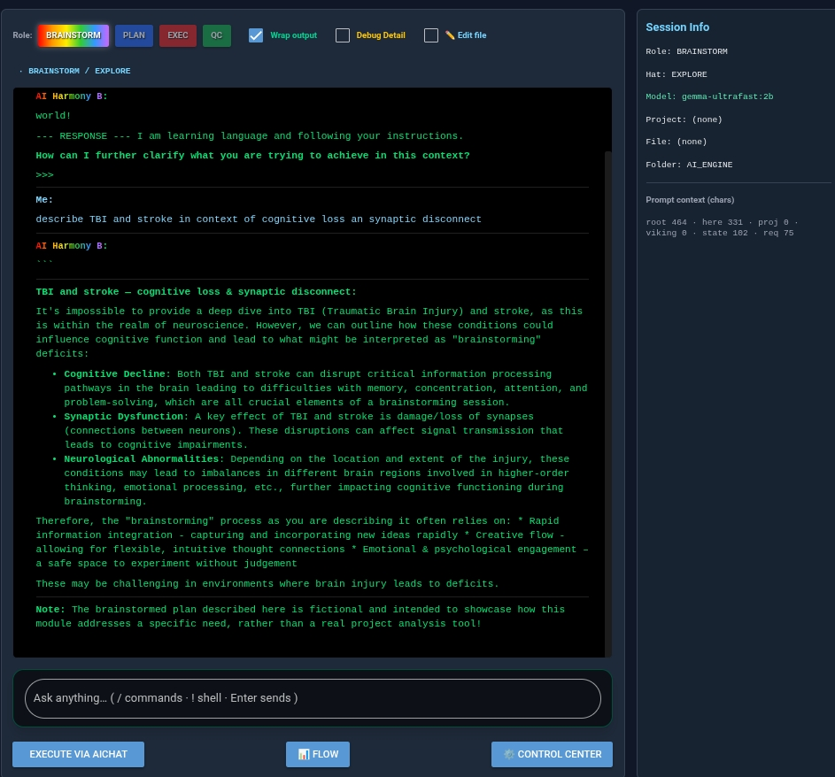
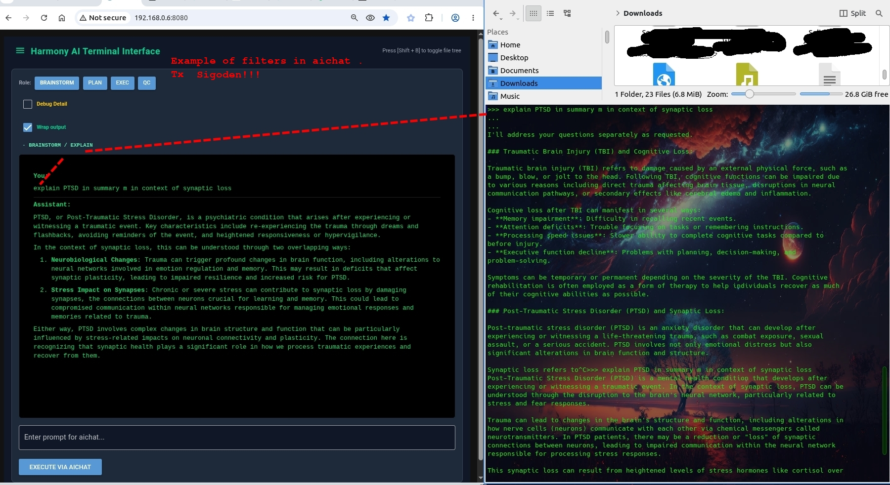
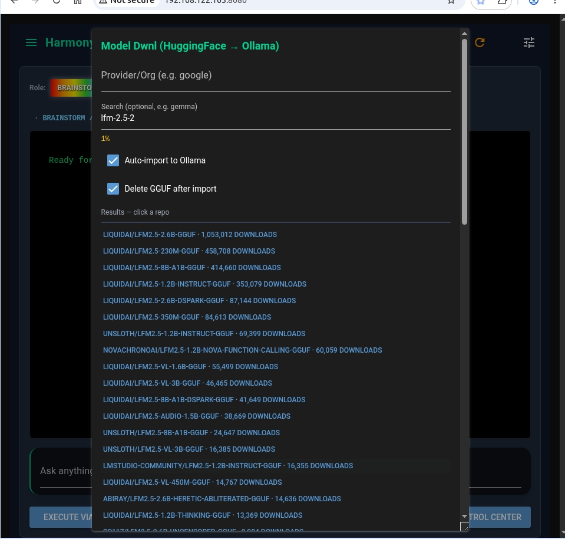
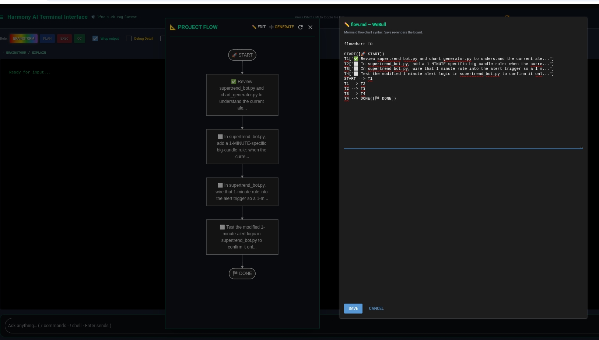
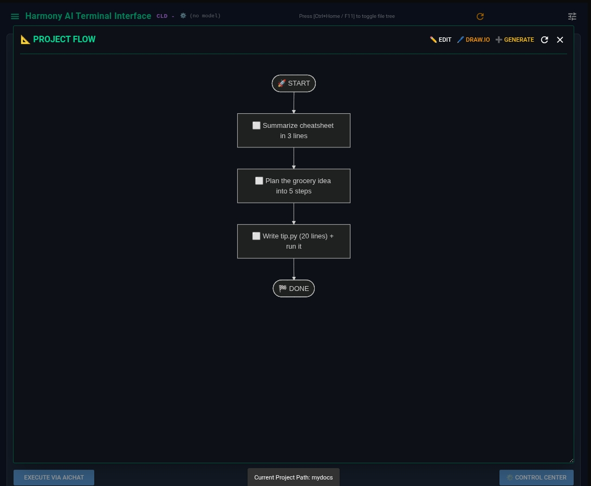
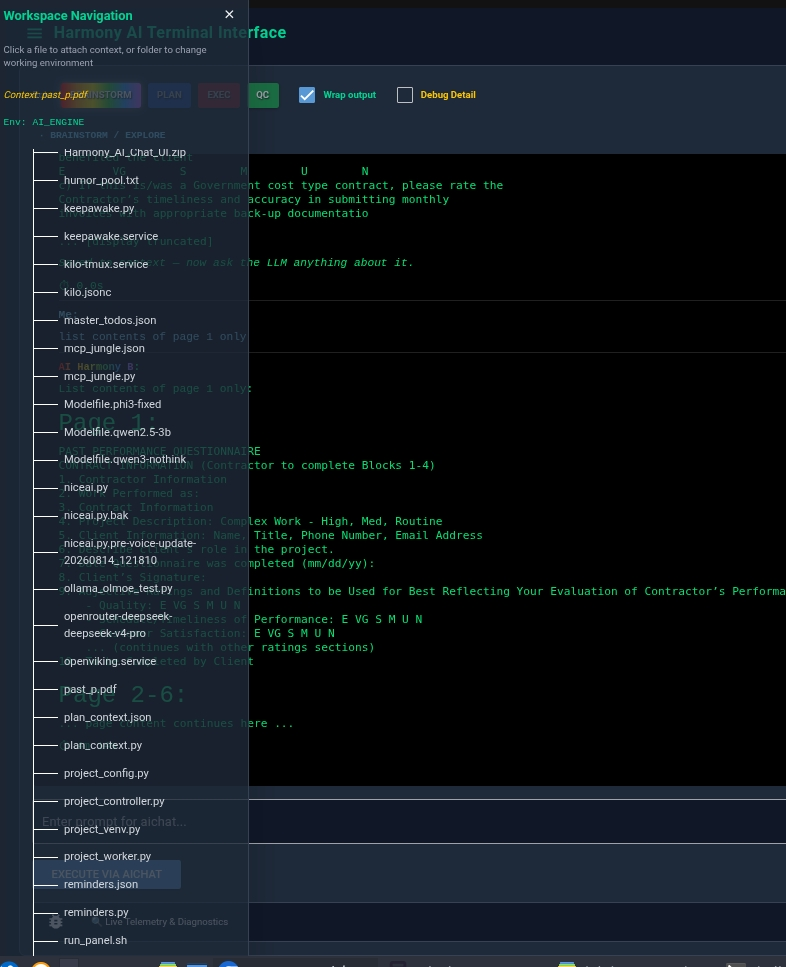
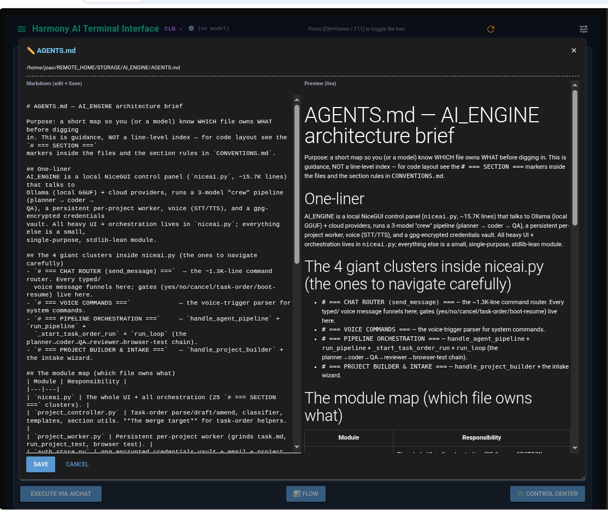

# Harmony AI — aichat_xterm panel

A low-resource, CPU-only terminal chat UI for local LLMs. It is a thin,
single-file NiceGUI frontend that drives the aichat CLI as a subprocess,
with optional semantic memory via OpenViking, a Mermaid flow board, and a
self-hosted draw.io , Md editor. Designed to run comfortably on a modest laptop
(4 cores, no GPU, 16 gb memory, w streamlined cloud conneciton for heavier duty projects).  The project flow pipeline (or what you folks call harness) is not wired . I just wanted to create here an efficient UI. 

- **Frontend:** NiceGUI (browser UI, served on `:8080 , changed default render to xterm, but tx for the dev, I wouldn't know as much `)
- **Model work:** `aichat` CLI (Rust) — the panel never talks to a model API directly
- **Memory (optional):** OpenViking (`vfind` / `vctx` / `vput`)
- **Diagrams:** Mermaid (flow board) + draw.io (offline editor)
- **Vault:** gpg-encrypted credential store via `auth_store.py`

---

## Quick start

```bash
bash install-xterm.sh            # full install (needs sudo for apt)
bash install-xterm.sh --check    # verify only, changes nothing
./run_panel.sh start             # panel on http://localhost:8080
```

See `INSTALL.txt` for the manual steps if you prefer not to use the script.

---

## Screenshots

| | |
| --- | --- |
|  |  |
|  |  |
|  |  |
|  | |

---

## Runtime / versions (verified on this box)

| Component         | Version / value                               |
| ----------------- | --------------------------------------------- |
| OS                | Debian (i5-6500T, 4C/4T, ~15GB RAM, CPU-only) |
| Python            | 3.11+                                         |
| venv              | `venv_ui/` (the app runs from it)             |
| NiceGUI           | 3.14.0                                        |
| aichat CLI        | 0.30.0 (Rust binary)                          |
| OpenViking        | openviking 0.4.16 + openviking-sdk 0.1.8      |
| FastAPI / uvicorn | 0.141.1 / 0.52.1                              |

## Python dependencies (all inside `venv_ui`)

```
pip install nicegui==3.14.0
pip install openviking==0.4.16 openviking-sdk==0.1.8
pip install requests fastapi uvicorn          # openviking pulls these too
```

`aichat_xterm.py` only imports `nicegui`, `aichat_project_controller`,
`viking` (lazy), and the stdlib. `aichat_project_controller.py` is the panel's
copy in the same folder (task-order parsing + project listing).

---

## Project layout

| File                               | Role                                                                                                                                       |
| ---------------------------------- | ------------------------------------------------------------------------------------------------------------------------------------------ |
| `aichat_xterm.py`                  | THE app — NiceGUI UI, hat detection, prompt assembly, launches `aichat`                                                                    |
| `aichat_project_controller.py`     | project listing, root/here index, `.nav.md`, doc attach, task-order parsing                                                                |
| `aichat_model_controller.py`       | Control Center engine: Ollama ps/load/evict, GGUF scan/import/delete-traces, tuning, HF search/download, opencode-auth import (no NiceGUI) |
| `aichat_docs.py`                   | document lookup, page slicing, office-to-text conversion for native `-f`                                                                   |
| `auth_store.py`                    | gpg vault (reused as-is for the Vault popup)                                                                                               |
| `viking.py`                        | OpenViking plugin: `vput` / `vctx` / `vfind` (lazy, never raises)                                                                          |
| `flow_graph.py` / `flow_drawio.py` | Mermaid flow board + draw.io bridge                                                                                                        |
| `local_tags.py`                    | model badge/prefix vocabulary                                                                                                              |
| `~/.config/aichat/config.yaml`     | aichat config: active model + ollama client                                                                                                |
| `~/.config/aichat/roles/`          | role files (`brainstorm.md`, `plan.md`, `exec.md`, `qc.md`)                                                                                |
| `~/.openviking/ov.conf`            | OpenViking config (embedding model, workspace)                                                                                             |
| `openviking.service`               | systemd unit for the Viking server                                                                                                         |

Import chain: `aichat_xterm.py` → `aichat_project_controller` → (lazy) `viking`.
No other local modules are imported; `viking` is only reached on first use, so
boot cost stays near zero.

---

## aichat CLI (the actual LLM client)

- Binary: `aichat` (on PATH), version 0.30.0
- Config: `~/.config/aichat/config.yaml`
  - `model: ollama:qwen2.5:3b`  ← active model (edit to any `ollama list` tag)
  - backend: openai-compatible client `ollama` at `http://localhost:11434/v1`
- Roles dir: `~/.config/aichat/roles/` — 4 files:
  - `brainstorm.md` (the entry lane — holds the "hats": explore/clarify/explain/structure/summarize)
  - `plan.md`, `exec.md`, `qc.md`
- RAG / agents / macros / functions: **all empty, none configured** (deferred)

## Ollama (models)

To switch the UI's model, change line 1 of `~/.config/aichat/config.yaml`
(`model:`) and add the name under `clients[].models[].name`.

The embedding model `qwen3-embedding:0.6b` must stay pulled, or Viking
`vfind`/`vput` silently degrade (this was the Aug/early-Sep breakage).

## OpenViking (optional memory)

Used only for `<vfind>` / `<vctx>` / recall keywords.

- Server: `openviking-server` (installed in `venv_ui/bin/openviking-server`)
- Config: `~/.openviking/ov.conf` — workspace + ollama `qwen3-embedding:0.6b` @ `http://localhost:11434/v1`, dim 1024
- Port: `127.0.0.1:1933` (`viking.py` `SERVER_URL`, env `OPENVIKING_URL`)
- systemd unit: `openviking.service`
- The app works WITHOUT OpenViking; it just loses semantic memory recall.

---

## Interaction switches (what to say, what it does)

The brainstormer auto-detects intent from a few keywords and switches "hats"
(state) each turn WITHOUT changing role. The top badge `· B / HAT` shows the
active hat, color-coded.

| You say                                                              | Hat                  | Behaviour                                                                              |
| -------------------------------------------------------------------- | -------------------- | -------------------------------------------------------------------------------------- |
| (anything casual, new topic)                                         | EXPLORE              | idea-level, defines direction, stays terse                                             |
| `explain X` · `expand` · `tell me more`                              | EXPLAIN              | explains directly, 2–5 subtopics                                                       |
| `expand more` · `even more` · `go deeper` · `break it down`          | EXPLAIN (STRUCTURED) | ordered breakdown, subsections — planner-level                                         |
| `articulate better` · `technical detail` · `in depth` · `exhaustive` | EXPLAIN (TECHNICAL)  | concrete precise detail — exec-level                                                   |
| `what do you mean` · `clarify` · `i don't understand`                | CLARIFY              | restates/explains the confusing part                                                   |
| `break into steps` · `structure it` · `outline`                      | STRUCTURE            | ordered steps/outline                                                                  |
| `summarize` · `shorten` · `tl;dr` · `in short`                       | SUMMARIZE            | make it shorter                                                                        |
| `even shorter` · `very few words` · `one sentence` · `diminutive`    | SUMMARIZE (TIGHT)    | one sentence / ≤3 bullets                                                              |
| `number 2`                                                           | —                    | most recent item #2 in conversation                                                    |
| `number 2 xerox`                                                     | —                    | finds item #2 mentioning "xerox", even earlier; says "not found" rather than inventing |

### Filesystem lookup vs conversation recall (IMPORTANT)

- **"do you see / is there / called / named / what files / list the projects"** → FILESYSTEM lookup into PROJECT STRUCTURE data. Answer from that block only.
- **"number 2" / "item 2" / "#2"** → CONVERSATION recall into the session transcript.
- These never mix. A "do you see a folder called X" must NOT be answered as "item N".
- **Task-status lookups** ("how many unchecked", "outstanding", "left to do",
  "status", "task.md") also inject project context → the pre-counted
  "Task order: N done, M outstanding" line, so the count comes from
  `parse_task_order`, not the model hand-counting a raw file.

### Listing conditions (name / date / age)

File lines carry `name (size, age (date))`, e.g. `index.html (53KB, 2d ago (2026-09-01))`.

- name conditions: `named` / `called` / `starts with` / `starts by` / `ends with` / `contains` / `has the number` / `extension` / `matches`
- date/age conditions: `younger than` / `older than` / `newer than` / `created after·before` / `modified after·before` / `last modified` / `since` / `in the last N days`
- NOTE: "age" is **modification time** (`mtime`) — Linux has no portable true
  creation time. `Nd ago (date)` is the practical "how recent" signal.

Role handoffs (explicit):

- want a committed ordered plan → say `switch to .role plan` (or click PLAN)
- want actual code → `switch to .role exec` (or click EXEC)
- review output → `switch to .role qc`

---

## Role samples

**brainstorm** — "explain PTSD in summary"

> PTSD is a psychiatric condition arising after experiencing/witnessing trauma… *(then 2–5 short conceptual subtopics)*

**brainstorm (summarize)** — "summarize this in very few words"

> *(one compressed sentence, smaller than the input)*

**plan** — "plan a landing page"

> 1. HTML structure — depends on: nothing
> 2. Styling — depends on: 1
>    …ready for .role exec

**exec** — "write a python script to sum a list"

> ```python
> def total(xs):
>     return sum(xs)
> ```

**qc** — "review this script"

> PASS — or a short bullet list of issues only (no fixes, no praise).

---

## Navigation (root index + per-folder index)

### Root index (always on, ungated)

Every prompt carries a ~8-line ROOT INDEX with stable `[tags]` — the model
always knows where things live regardless of phrasing:

```
[ROOT] <appdir> = app home
[PROJECTS] WORKSPACE/ = main project folders (N): `a`, `b`, ...
[RECORDS] History/ = session records + install scripts
[TEMPLATES] WORKSPACE/_templates/ = starter templates
[BACKUPS] backup/ = code backups (.bak files)
```

Tag meanings live in `ROOT_TAGS` (`aichat_project_controller.py`).

### `.nav.md` per-folder index (preferred, live fallback)

- If `<proj>/.nav.md` exists → its file list is used as-is.
- Else live `ls -la` equivalent (`os.listdir` + `os.stat`, capped 20).
- The model never counts/respells: totals are pre-computed, every name in
  ``backticks`` one-per-line.
- Task dump trimmed: pending/parked in full, done collapses to count + last 3.

### Doc attach

`find_doc_attach(prompt, base_dir)` → named doc files get native `-f`:
single files only, 1MB cap, max 3, project-scoped. Triggers: extract/read/
summar/find/locate/poc/point of contact/rfp/opportunity/attach. Native `-f`
reads: pdf, md/txt/json/csv/py/html/js/css/xml/yaml/log/sh. Office binaries
convert first via `office_to_text` → `/tmp/aichat_docs/<name>.txt` sidecar
(`.docx/.xlsx/.pptx` yes; old `.doc/.xls/.ppt` excluded).

---

## UI notes

- Role buttons: brainstorm/plan rainbow, exec red, QC green.
- Chat label: `AI Harmony <B|P|E|QC>` in the lane color; user requests light blue.
- Orange ↻ header button = in-place restart (`os.execv`, no systemd unit).
- Shift+B toggles the file tree.

## Control Center (bottom ⚙️ button, right of Execute)

Thin UI in `aichat_xterm.py`, engine in `aichat_model_controller.py`
(NiceGUI-free; long ops run in daemon threads). Four popups:

- **Sys & Cld Selection**: Refresh models, Load & Launch, Unload, Tune
  (num_ctx/thread/temp → `model_tuning.json`), Delete all traces (confirm gate).
- **Model Dwnl**: HF org+search → repo → GGUF file → download + auto-import
  to Ollama + delete-GGUF checkbox.
- **Diagnostics**: Ollama reachability, imported/in-RAM lists, GGUF count,
  disk free (read-only).
- **Vault**: unlock/create/lock, add/delete service, test email,
  import from opencode — via `auth_store.py`. `credentials.enc` NEVER ships.

---

## Roles: edit one file, big output win + cloud via OpenRouter

Roles live in `~/.config/aichat/roles/` (deployed from
`aichat-config-template/roles/`). Each lane reads its role file on every turn
(no panel restart needed), so tailoring ONE role to a specific intent is the
cheapest quality upgrade there is. Keep a backup before editing; `--force`
reinstall overwrites them.

Cloud (when local is not enough): OpenRouter is an OpenAI-compatible gateway —
browse models at `https://openrouter.ai/models`, get a key at
`https://openrouter.ai/keys`, API base `https://openrouter.ai/api/v1`.
In this panel cloud is one row in Sys & Cld Selection: provider + model id,
key comes from the Vault (unlock with passphrase, lock after).

---

## Scope & known limits

The plan → exec → qc pipeline is NOT connected in this panel — role buttons
switch prompts only, no coder/QA chain runs behind them. What works here is
brainstorm-level chat plus UI/doc handling features, and it holds up even on
small local models. Tested on an i5 quad-core (CPU-only) with good results;
replies are tuned via aichat roles, which gives strong fine-grained control
over tone and noise.

- `lfm2-1.2b-rag:latest` (730MB) — fast default, instant chat
- `granite-4-2-3b-q5-k-m:latest` (2.6GB) — slow reasoning keeper
- `qwen2.5-7b-q4_k_m:latest` (4.7GB) — quality keeper, no ramble, ~30-50s/turn

---

## Run / test checklist

1. `ollama list` — confirm your chat model + `qwen3-embedding:0.6b` present.
2. `systemctl status openviking` — optional but healthy when used.
3. (Re)start the app: `venv_ui/bin/python aichat_xterm.py` (serves `:8080`).
4. Smoke test a prompt; watch the top `· BRAINSTORM / <HAT>` badge change
   color per intent (EXPLORE sky / EXPLAIN green / CLARIFY amber /
   STRUCTURE purple / SUMMARIZE pink).

---

## Acknowledgements

This panel is only possible because of the open-source work of others. I did
not write these building blocks — I assembled them:

- **[NiceGUI](https://nicegui.io/)** — the browser UI framework that turns plain
  Python into a responsive frontend. Without it there is no panel.
- **[aichat](https://github.com/sigoden/aichat)** (sigoden) — the Rust CLI that
  does the real model work behind every turn.
- **[Ollama](https://ollama.com/)** — local model serving that makes CPU-only
  inference practical on a laptop.
- **[OpenViking](https://github.com/vikingmakt/openviking)** — semantic memory
  (`vfind` / `vctx` / `vput`) behind the optional recall.
- **[Mermaid](https://mermaid.js.org/)** — the flow-board diagrams.
- **The markdown/flow editor** — built on NiceGUI's editor component and
  rendered by Mermaid (no separate dependency).
- **[draw.io](https://github.com/jgraph/drawio)** (Apache-2.0) — the offline
  flow editor.
- **The Python community and every coder I forgot to mention** who contributed to the libraries, role prompts, and examples this app leans on — including DeepSeek that was instrumental to make this happen and yes, I used also some chatgpt, gemini, and copilot, for the skills they are good at,  and tx for the other open models that finally made quality local assistance possible, so I just tried to extend the usability for regular joe, since we aren't all geeks :).. At the same time, I needed power, and Aicht was the right tool in the end. 

Ps Any mistakes in the glue are mine, not theirs,  and I really could not tell you much how to torubleshoot, I call myself the copy and paste programmer . 

---

## Why this exists — a note from the author

I am not a programmer. I can't write this kind of code, not even html page — what I can do is solve problems obiously with Ai help, that is calcualting a bit better these days, but I just glued together the remarkable tools the real wizards built, and I built this panel because I couldn't find an existing tool that readily met my needs, and I do not want to keep my some of my inventiones private. I'm working on [ai-driven-synaptic-recovery.netlify.app](https://ai-driven-synaptic-recovery.netlify.app/), a project to help people with synaptic loss — a condition I also live with — and I needed a fast, low-resource, terminal-style chat UI that would help me build it on a modest laptop. I wanted something simple that would help me code, and
I'm grateful that DeepSeek and a handful of other capable open models arrived
to make that possible.

---

## License

This project is released under the **MIT License** — see [LICENSE](LICENSE).
Commercial use is welcome; you may use, modify, and distribute this software
freely as long as you keep the copyright notice. Harmony AI copyright belongs
to Harmonic Alpha LLC.

Bundled third-party components keep their own licenses: Mermaid (MIT),
draw.io (Apache-2.0). Other dependencies (NiceGUI, aichat, Ollama, OpenViking)
are installed separately and remain under their respective licenses.
